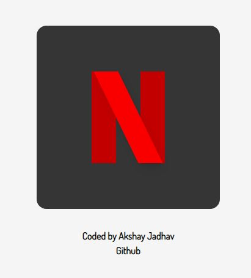

# Logos

Practices HTML, CSS and Tailwind CSS by bulding diffrent logos. Git Logo is made with CSS and other are nade with tailwind CSS

## 1. Cred Logo

## 2. Netflix Logo

## 3. Google Logo

## 4. Git Logo

## 5. React Logo

## 6. MicrosoftLogo

